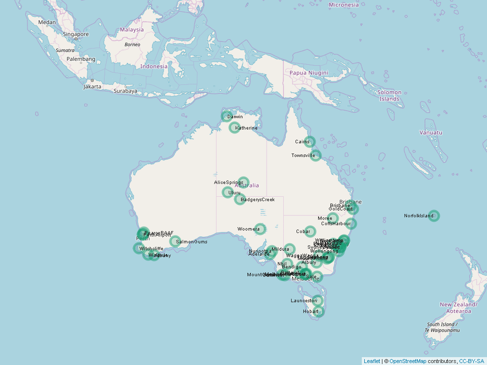

```{r echo=FALSE, message=FALSE, warnings=FALSE}
# load required libraries
library(ggplot2) # plotting lib
library(gridExtra) # arrange grids
library(dplyr)  # data manipuation
library(mice)  # data imputing
library(corrplot) # correlation matrix plotting/printing
library(caret) # predictive models
library(pROC) # to measure model performance
library(leaflet) # maps
library(RColorBrewer) # color palettes
library(VIM) # missing value analysis 
library(lattice) # another data plotting library
library(mapview) # saves map objects as file
library(png) # deals with png file measurements
library(knitr) #

# pick palettes
mainPalette = brewer.pal(8,"Dark2")
```

```{r global_options, include=FALSE}
# make the images flow nicely
knitr::opts_chunk$set(fig.pos = '!h')
```

## Introduction


## Background


## Objective


# Data Analisys

The data set we are going to use for our research contains daily weather observations from numerous Australian weather stations from 2007 till 2017. There are over 142000 records. It has been sourced from [Kagle](https://www.kaggle.com/jsphyg/weather-dataset-rattle-package)


## Data Dictionary

We exclude the variable Risk-MM when training your binary classification model. If we don't exclude it, you will leak the answers to our model and reduce its predictability

Column Name            | Column Description  
-----------------------| ------------------- 
Date                   | Date of observation 
Location               | Common name of the location of the weather station
MinTemp                | Minimum temperature in degrees celsius
MaxTemp                | Maximum temperature in degrees celsius
Rainfall               | Amount of rainfall recorded for the day in mm
Evaporation            | So-called Class A pan evaporation (mm) in the 24 hours to 9am
Sunshine               | Number of hours of bright sunshine in the day
WindGustDir            | Direction of the strongest wind gust in the 24 hours to midnight
WindGustSpeed          | Speed (km/h) of the strongest wind gust in the 24 hours to midnight
WindDir9amDirection    | Of the wind at 9am
WindDir3pmDirection    | Of the wind at 3pm
WindSpeed9amWind       | Wind speed (km/hr) averaged over 10 minutes prior to 9am
WindSpeed3pmWind       | Wind Speed (km/hr) averaged over 10 minutes prior to 3pm
Humidity9amHumidity    |Humidity (percent) at 9am
Humidity3pmHumidity    | Humidity (percent) at 3pm
Pressure9amAtmospheric | Pressure (hpa) reduced to mean sea level at 9am
Pressure3pmAtmospheric | Pressure (hpa) reduced to mean sea level at 3pm
Cloud9amFraction       | Area of sky obscured by cloud at 9am. This is measured in "oktas", which are a unit of eigths. It records how many eigths of the sky are obscured by cloud. A 0 measure indicates completely clear sky whilst an 8 indicates that it is completely overcast
Cloud3pmFraction       | Area of sky obscured by cloud (in "oktas": eighths) at 3pm. See Cload9am for a description of the values
Temp9amTemperature     |Temperature (degrees C) at 9am
Temp3pmTemperature     |Temperature (degrees C) at 3pm
RainTodayBoolean       | Rainy today. 1 if precipitation (mm) in the 24 hours to 9am exceeds 1mm, otherwise 0
RISK_MM                | Amount of rain. A kind of measure of the "risk". This column is redundant and will be dropped
**RainTomorrowThe**    | **Target variable. Will it rain tomorrow?**


## Data Exploration

Let's take a close look at the data set. We start with loading weather observations from the file into a data frame. We remove RISK_MM as explained and convert Date column to *date* format 

```{r message=FALSE, warning=FALSE}
weatherData = read.csv("../data/weatherAUS.csv", header = TRUE, na.strings = c("NA","","#NA"),sep=",")
weatherData = subset(weatherData, select = -RISK_MM)
weatherData$Date = as.Date(as.character(weatherData$Date),"%Y-%m-%d")
```
  
Now let's load coordinates of the weather stations and have a bird-eye view of the weather station locations

```{r map, dpi = 100, echo=FALSE, fig.cap="Australian Weather Stations", message=FALSE, warning=FALSE, out.width="1.1\\linewidth", include=TRUE, fig.align="center"}
locations = read.csv("../data/AusCoordinates.csv", header = TRUE, sep=",")
# The code that generates the map has been excluded for performance sake
# map = leaflet() %>% setView(lng = 133.8836, lat = -23.69748, zoom = 4 ) %>% addTiles() %>% 
#  addCircleMarkers(data = locations, lng = ~Longtitude, lat = ~Latitude,fillColor = mainPallet[1], 
#                   color = mainPallet[1],  label =~Location,  
#                   labelOptions = labelOptions(noHide = T, textOnly = T))
# mapshot(map, file ="images/weatherStations.png")

```
\newpage

Let's review data summary

```{r} 
summary(weatherData)
```
### Missing Data

Further analisys of data shows that many features are missing. Some data losses are very significant. We are going to identify what data is missing and if it is feasible to recover the data.

```{r}
print(sort(colSums(is.na(weatherData)), decreasing = T))
```

To speed up data processing and plot rendering we are going to use a data sample. For population of 142K obesrvations, 20K sample size would be sufficient for 99% confidence level with the condience interval 1

```{r plot_aggr_missing, fig.align="center", fig.cap="Missing Data Summary"}
weatherSample = sample_n(weatherData, 20000)
aggr(weatherSample, numbers = F, prop = T, col = mainPalette, sortVars = T, bars = F, varheight = T)
``` 

As demonstrated in Figure \ref{fig:plot_aggr_missing} *Sunshine*, *Evaporation* and *Clouds* columns saffer the loss of data between **48%** and **38%**. This is significant! Sinse we are dealing with the weather patterns we should be observing cyclical data pattenrs. Let's review data stribution of features that damaged the most.

```{r plot_margin1, echo=FALSE, message=FALSE, warning=FALSE, paged.print=FALSE,fig.align="center", fig.cap="Date/Evaporation Margin Plot", fig.height=4}
marginplot(weatherSample[, c("Date", "Evaporation")] , col = mainPalette, cex = 0.8, pch = 20)
```

```{r plot_margin2, echo=FALSE, message=FALSE, warning=FALSE, paged.print=FALSE,fig.align="center", fig.cap="Date/ Sunshine Margin Plot", fig.height=4}
marginplot(weatherSample[, c("Date", "Sunshine")] , col = mainPalette, pch = 20, cex = 0.8)
```

```{r plot_margin3, echo=FALSE, message=FALSE, warning=FALSE, paged.print=FALSE,fig.align="center", fig.cap="Date/ Pressure3pm Margin Plot", fig.height=4}
marginplot(weatherSample[, c("Date", "Pressure9am")] , col = mainPalette, pch = 20, cex = 0.8)
```
\newpage

So what do the margin plots tell us? First of all let's take a look at *Date* axis. The *Date* has been converted to number to ensure continuous flow of the data . All features we picked exhibit cyclical pattern as expected. Along the vertical axis we obesrve the box plot of the respective feature. *Evaporaton* data is quite remarkable (Figure  \ref{fig: plot_margin1}); it has very narrow distribution and a lot of so-called outliers. Though forces of nature follow sesonal patters they often exhibit wdie ranhe of seasonal anomalies, which the plots highlight. The disribution of the missing data of a given feature is depicted along the horizontal axis. In all three cases the missing data is randomly distirubted along observed date range. Along the horizontal axis we may see box plots of the date and a given feature. *Presure9am* ((Figure  \ref{fig: plot_margin3})) distributed evenly across the observed date frame. *Evaporation* and *Sunshine* exibit more data lossess towards the end of the observed period  

Let's examine one more dimention of the missing data, namely featues vs feature vs location
\newpage

```{r plot_missLocation, echo=FALSE, message=FALSE, warning=FALSE, paged.print=FALSE,fig.align="center", fig.cap="Missing Data By Location", fig.height= 9}
tmp = weatherData %>% group_by(Location) %>%
  select_if(function(x) any(is.na(x))) %>% 
  summarise_all(funs(sum(is.na(.))))  %>%  rowwise() %>% 
    summarize(Location, MissingObservations=sum(
  MinTemp + MaxTemp + Rainfall + Evaporation + Sunshine + WindGustDir + WindGustSpeed +
  WindDir9am + WindDir3pm + WindSpeed9am + WindSpeed3pm + Humidity9am + Humidity3pm + Pressure9am +
  Pressure3pm + Cloud9am + Cloud3pm + Temp9am + Temp3pm + RainToday))
ggplot(tmp, aes(x=Location, y=MissingObservations )) + geom_bar(stat = "identity", fill=mainPalette[2], colour=mainPalette[2]) +
 coord_flip() + theme(axis.text.x = element_text(angle = 45, hjust = 1))  

avgPerLocation = round(mean(tmp$MissingCount), digits = 0)
rm(tmp)
```

Remarkably Firure \ref{fig:plot_missLocation} shows that **`r avgPerLocation`**  observations are missing on average per location. Though if we take a second look at the weather station map \ref{fig:map} we would see that Mount Gini (the station that miss the most data), Bendigo and Ballarat are close to Melbrun, where the staff has kept observing data on regular basis. Newcastle to Sydney and so on...

### Data correlation and other observations

Let's examine how the features are correlated to each other. Knowing weather we can make an accurate prediction that the temparature features should be highly correlated, as well as pressure, wind speed, clouds and humidity groups 
```{r plot_corr, echo=FALSE, message=FALSE, warning=FALSE, paged.print=FALSE,fig.align="center", fig.cap="Data Correlation", out.width="1.1\\linewidth"}
corrplot(cor(select_if(weatherData, is.numeric), use="pairwise.complete.obs"),
         method="color", type="upper",order="hclust", col = mainPalette, number.cex = .6,
         addCoef.col = "black", tl.col="black", tl.srt=45,sig.level = 0.4, insig = "blank", diag=FALSE )
```

Figure \ref{fig:plot_corr} confirms our intial guess. This observation will help us to elminate redundant features later when we get to the point of selecting useful predictors for our model

## Data Preparation

# Modeling and Evalutation

## Decision Tree Model

## Naive Bayes Model

## Random Forest Model

## Logistic Regression Model

## Model Comparison


# Model Deployment

# Conclusion

# Bibliography
